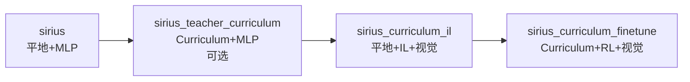
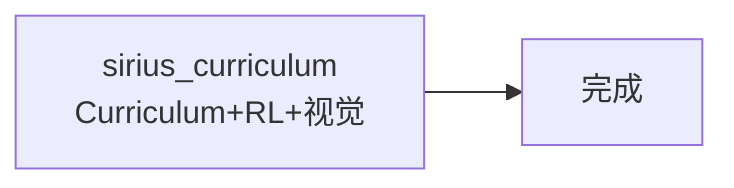

# Sirius 任务对比总结

## 📊 所有任务一览

现在我们有 **6 个** Sirius 相关任务：

| 任务名 | 策略 | 相机 | 地形 | 输入 | 用途 |
|--------|------|------|------|------|------|
| **sirius** | ActorCritic (MLP) | ❌ | 平地 | 45维本体 | 教师策略训练（基础） |
| **sirius_teacher_curriculum** | ActorCritic (MLP) | ❌ | Curriculum | 45维本体 | 教师策略后训练（复杂地形） |
| **sirius_curriculum** | VisionProprioceptionAC | ✅ | Curriculum | 45维+视觉 | 视觉学生直接训练 |
| **sirius_curriculum_il** | VisionProprioceptionAC | ✅ | 平地 | 45维+视觉 | IL阶段1：平地模仿 |
| **sirius_curriculum_finetune** | VisionProprioceptionAC | ✅ | Curriculum | 45维+视觉 | IL阶段2：复杂地形微调 |
| **sirius_diff_vis** | VisionProprioceptionAC | ✅ | 桥梁 | 45维+视觉 | 桥梁任务 |

## 🎯 推荐的训练流程

### 方案A: IL训练流程（推荐）



**步骤**:
1. 训练教师（平地）: `python train.py --task=sirius --num_envs=4096`
2. （可选）教师后训练: `python train.py --task=sirius_teacher_curriculum --resume`
3. IL平地训练: `python train.py --task=sirius_curriculum_il`
4. Curriculum微调: `python train.py --task=sirius_curriculum_finetune --resume`

### 方案B: 直接训练流程



**步骤**:
1. 直接训练: `python train.py --task=sirius_curriculum --num_envs=1024`

## 📝 详细使用说明

### 1️⃣ sirius（教师策略 - 平地）

**目的**: 训练基础的教师策略

```bash
# 从头训练
python train.py --task=sirius --num_envs=4096 --headless

# 预期输出
# - 策略: ActorCritic (MLP)
# - 输入: 45维 (纯本体)
# - 地形: 平地
# - 迭代: ~1800
```

**检查点**:
- RL reward > 80
- Episode length ~20s
- 能稳定跟随速度命令

---

### 2️⃣ sirius_teacher_curriculum（教师策略 - 复杂地形）✨新增

**目的**: 让教师策略在复杂地形上进行后训练，测试纯本体感知的泛化能力

```bash
# 从平地checkpoint继续（推荐）
python train.py --task=sirius_teacher_curriculum --num_envs=4096 --headless \
    --resume --load_run=logs/sirius/YYYY-MM-DD/HH-MM-SS

# 或从头开始
python train.py --task=sirius_teacher_curriculum --num_envs=4096 --headless
```

**预期输出**:
- 策略: ActorCritic (MLP)
- 输入: 45维 (纯本体)
- 地形: Curriculum（从简单到困难）
- 迭代: ~2000

**用途**:
1. 对比教师策略在复杂地形上的表现
2. 为IL提供更强的教师（如果需要）
3. 研究视觉的必要性

---

### 3️⃣ sirius_curriculum（视觉学生 - 直接训练）

**目的**: 不通过IL，直接在curriculum地形上训练视觉策略

```bash
python train.py --task=sirius_curriculum --num_envs=1024 --headless
```

**优点**: 简单直接
**缺点**: 视觉编码器训练较慢，可能陷入局部最优

---

### 4️⃣ sirius_curriculum_il（IL阶段1 - 平地模仿）

**目的**: 通过IL从教师学习，在平地上训练视觉策略

```bash
python train.py --task=sirius_curriculum_il --num_envs=1024 --headless \
    --teacher_model=logs/sirius/YYYY-MM-DD/HH-MM-SS/model_1800.pt
```

**要求**: 先完成 `sirius` 训练

---

### 5️⃣ sirius_curriculum_finetune（IL阶段2 - 复杂地形微调）

**目的**: 在curriculum地形上微调IL训练的视觉策略

```bash
python train.py --task=sirius_curriculum_finetune --num_envs=512 --headless \
    --resume --load_run=logs/sirius_curriculum_il/stage1_flat_parallel
```

**要求**: 先完成 `sirius_curriculum_il` 训练

---

## 🔬 对比实验建议

### 实验1: 教师策略泛化能力

**问题**: 纯本体感知策略能否在复杂地形上泛化？

**方法**:
1. 训练: `sirius` (平地)
2. 测试: `sirius_teacher_curriculum` (后训练)
3. 对比: 平地训练 vs 后训练的性能

**预期**: 后训练应该能提升在复杂地形上的表现，但可能不如有视觉的策略

---

### 实验2: 视觉的必要性

**问题**: 视觉对于复杂地形导航是否必要？

**方法**:
1. 无视觉: `sirius_teacher_curriculum`
2. 有视觉: `sirius_curriculum_finetune`
3. 对比: 在相同地形上的成功率和Episode长度

**预期**: 视觉策略在缝隙、坑洞等需要前瞻的地形上表现更好

---

### 实验3: IL vs 直接训练

**问题**: IL是否能加速视觉策略的训练？

**方法**:
1. IL训练: `sirius_curriculum_il` → `sirius_curriculum_finetune`
2. 直接训练: `sirius_curriculum`
3. 对比: 达到相同性能所需的总迭代数

**预期**: IL应该能显著加速训练，但最终性能可能相似

---

## 📈 性能基准参考

基于经验的预期性能（仅供参考）：

| 任务 | 地形 | 视觉 | RL Reward | Episode长度 | 训练时间 |
|------|------|------|-----------|-------------|----------|
| sirius | 平地 | ❌ | 80+ | 20s | 4-6h |
| sirius_teacher_curriculum | Curriculum | ❌ | 65-70 | 16-18s | 6-8h |
| sirius_curriculum | Curriculum | ✅ | 70-75 | 18-20s | 8-12h |
| sirius_curriculum_il | 平地 | ✅ | 75+ | 18s | 3-4h |
| sirius_curriculum_finetune | Curriculum | ✅ | 75-80 | 20s | 2-3h |

**总结**: IL流程总时间约 9-12h，直接训练约 8-12h，但IL更稳定。

---

## 🎓 总结

### 新增任务的价值

`sirius_teacher_curriculum` 让我们能够：

1. **对比研究**: 了解纯本体感知在复杂地形上的极限
2. **更强教师**: 如果需要，可以用它作为IL的教师（虽然可能过拟合）
3. **视觉价值**: 量化视觉对于导航的实际价值

### 推荐工作流

**如果你想快速得到结果**:
```bash
python train.py --task=sirius_curriculum --num_envs=1024 --headless
```

**如果你想要最稳定的训练**:
```bash
# 1. 教师
python train.py --task=sirius --num_envs=4096 --headless

# 2. IL
python train.py --task=sirius_curriculum_il --num_envs=1024 --headless

# 3. 微调
python train.py --task=sirius_curriculum_finetune --num_envs=512 --headless --resume
```

**如果你想研究视觉的必要性**:
```bash
# 1. 无视觉后训练
python train.py --task=sirius_teacher_curriculum --num_envs=4096 --headless

# 2. 有视觉训练
python train.py --task=sirius_curriculum --num_envs=1024 --headless

# 3. 对比评估
python play.py --task=sirius_teacher_curriculum
python play.py --task=sirius_curriculum
```

---

**更新日期**: 2025年11月14日
**新增任务**: sirius_teacher_curriculum
